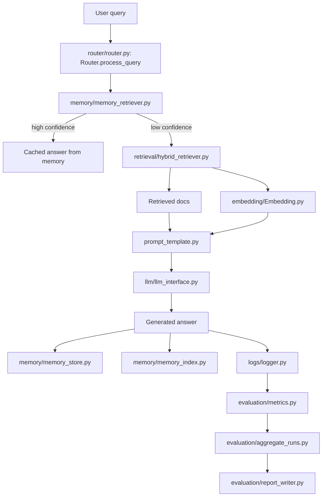

# Repo Knowledge Graph

This file is the compact, repo-local context map for the Predictive Semantic Memory (PSM) project. It is meant to reduce repeated full-repo re-analysis by giving future agents a stable entry point, the main control flow, and the files that own each responsibility.

## What This Repo Is

PSM is a retrieval-augmented QA pipeline with a persistent memory layer. The system routes each query through memory first, falls back to hybrid retrieval when memory confidence is low, and then uses an LLM backend to generate the answer. Experiments are evaluated with standard QA metrics and logged to disk.

## Primary Entry Points

- [main.py](PSM_Experiment_Setup_Research/main.py) - Small interactive CLI for query/metrics checks.
- [run_psm_experiments.py](PSM_Experiment_Setup_Research/run_psm_experiments.py) - Main experiment runner for smoke and pilot runs.
- [phase2_triviaqa_run.py](PSM_Experiment_Setup_Research/phase2_triviaqa_run.py) - Phase 2 run variant.
- [PSM_Kaggle_Experiment.ipynb](PSM_Experiment_Setup_Research/PSM_Kaggle_Experiment.ipynb) - Notebook entrypoint for Kaggle/Colab.

## Knowledge Graph

## Node Map

| Node | Responsibility | Important Files |
|------|----------------|-----------------|
| Router | Decides memory vs retrieval path, generates prompts, logs runs, stores new memories | [router/router.py](PSM_Experiment_Setup_Research/router/router.py) |
| Memory layer | Persistent FAISS-backed memory lookup and storage | [memory/](PSM_Experiment_Setup_Research/memory) |
| Retrieval layer | Hybrid BM25 + embedding retrieval | [retrieval/](PSM_Experiment_Setup_Research/retrieval) |
| Embeddings | Query/document vectorization | [embedding/Embedding.py](PSM_Experiment_Setup_Research/embedding/Embedding.py) |
| Prompting | Assembles the final LLM prompt | [prompt_template.py](PSM_Experiment_Setup_Research/prompt_template.py) |
| LLM backend | Selects Kaggle/HF or other backend via environment config | [llm/llm_interface.py](PSM_Experiment_Setup_Research/llm/llm_interface.py), [llm/kaggle_llm.py](PSM_Experiment_Setup_Research/llm/kaggle_llm.py) |
| Ingestion | Loads and chunks corpus content | [ingestion/corpus_ingestor.py](PSM_Experiment_Setup_Research/ingestion/corpus_ingestor.py) |
| Evaluation | Computes EM, F1, ROUGE-L, BLEU and aggregates run reports | [evaluation/metrics.py](PSM_Experiment_Setup_Research/evaluation/metrics.py), [evaluation/aggregate_runs.py](PSM_Experiment_Setup_Research/evaluation/aggregate_runs.py), [evaluation/report_writer.py](PSM_Experiment_Setup_Research/evaluation/report_writer.py) |
| Logging | Stores query/run telemetry and metrics history | [logs/logger.py](PSM_Experiment_Setup_Research/logs/logger.py) |

## Control Flow

1. A query enters `Router.process_query()`.
2. `MemoryRetriever` checks whether the query can be answered from stored memory with sufficient confidence.
3. If confidence is high, the cached answer is returned directly.
4. If confidence is low, `HybridRetriever` retrieves supporting documents.
5. `build_prompt()` combines query, documents, and any prior answer context.
6. `get_llm()` selects the active backend and generates the answer.
7. Retrieved answers are written back into memory for future reuse.
8. `Logger` persists the run, and evaluation code summarizes results across runs.

## Important Behavior Notes

- `Router` is the main orchestration point and the best single file to inspect first for runtime behavior.
- Memory writes happen only after the retrieval path generates a new answer, so the system gradually becomes more reusable over time.
- Logging writes should use a valid output directory because run metadata is expected to persist across notebook and Kaggle-style sessions.
- The repo has both notebook and script entrypoints, so context should be read from the inner project root rather than only the top-level wrapper.

## Suggested Reading Order For Future Agents

1. [README.md](README.md)
2. [REPO_KNOWLEDGE_GRAPH.md](REPO_KNOWLEDGE_GRAPH.md)
3. [PSM_Experiment_Setup_Research/router/router.py](PSM_Experiment_Setup_Research/router/router.py)
4. [PSM_Experiment_Setup_Research/llm/llm_interface.py](PSM_Experiment_Setup_Research/llm/llm_interface.py)
5. [PSM_Experiment_Setup_Research/evaluation/metrics.py](PSM_Experiment_Setup_Research/evaluation/metrics.py)

## Update Rule

If the pipeline changes, update this file first before doing broad code searches. Keep the graph small, stable, and centered on the owning modules rather than on every implementation detail.